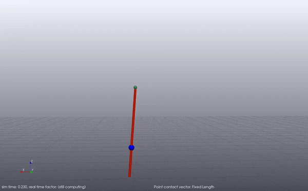
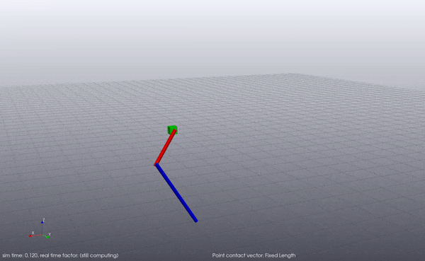
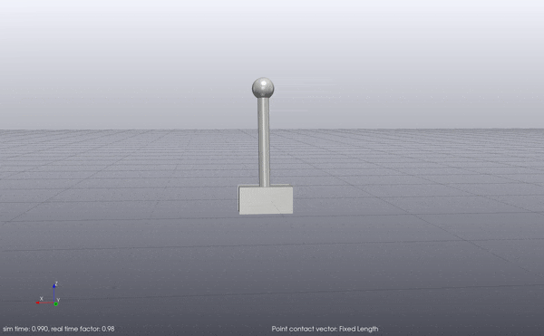
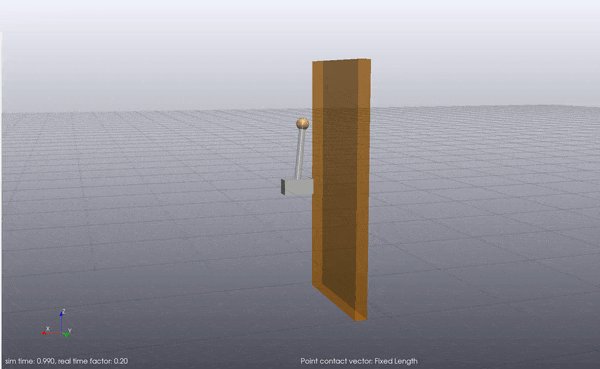
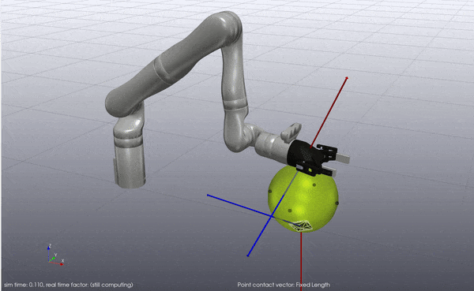
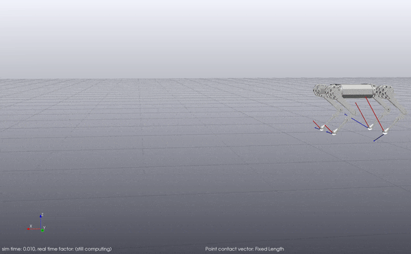

## About 

This repository contains code for trajectory optimization using Differential Dynamic Programming (DDP) 
and Iterative LQR (iLQR) in [Drake](https://drake.mit.edu/), with a particular focus on optimization
through [hydroelastic](https://drake.mit.edu/doxygen_cxx/group__hydroelastic__user__guide.html) contact. 

## Installation

Install the dependencies:
- Python 3
- Numpy
- [Drake](https://drake.mit.edu/installation.html)

Clone the repository:
```
git clone https://github.com/vincekurtz/drake_ddp/
```

Run the examples (see details below), e.g.,
```
python cart_pole_with_wall.py
```

## Examples

The `drake-visualizer` must be running to view the generated trajectories. Further parameters can be found in each python script. 

Code for running iLQR over arbitrary discrete-time Drake `System` objects is provided in `ilqr.py`. 

### No Contact

These examples are simple benchmark control systems. iLQR can be compared with the direct transcription method for each of these examples: see the parameters in each example script for details. 

#### Pendulum
`pendulum.py`: simple swing-up control of an inverted pendulum.



#### Acrobot
`acrobot.py`: swingup control of an underactuated acrobot. Performs 50 receding-horizon resolves in the spirit of model predictive control (MPC). 



#### Cart-Pole
`cart_pole.py`: stabilize a cart-pole system around the upright operating point. 



### Hydroelastic Contact

These are more complex examples that require making and breaking contact. Contact sequences are determined automatically by iLQR. Drake's AutoDiff capabilities are used to generate dynamics gradients, which can be slow.

#### Cart-Pole with Wall
`cart_pole_with_wall.py`: stabilize a cart-pole system around the upright operating point, with the help of a nearby wall.



#### Whole-Arm Manipulation
`kinova_gen3.py`: Move a large ball around using a Kinova Gen3 manipulator arm. 



#### Quadruped Gait Generation
`mini_cheetah.py`: Move a quadruped robot forward at a desired velocity. Performs 100 receding-horizon resolves in the spirit of MPC. 



